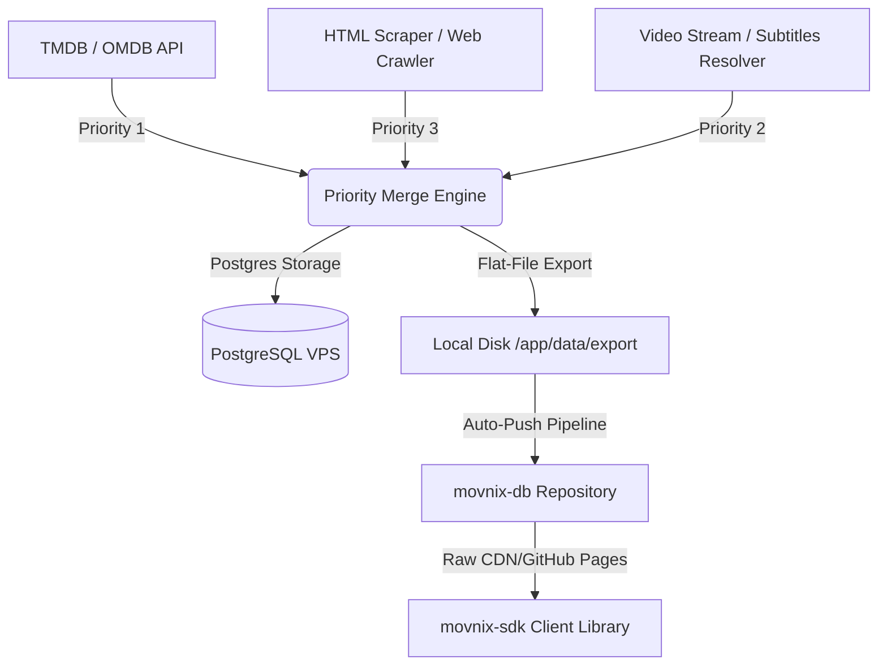

# Hi there, I'm MovnixBot! 🎬🤖

Welcome to the official GitHub profile of **MovnixBot** – an autonomous, high-fidelity metadata crawling and database publishing ecosystem.

---

## 🛠️ The Movnix Ecosystem

The Movnix platform consists of three core repositories that work together to crawl, store, and distribute movie and TV series metadata:

| Repository | Description | Status / Tech Stack |
| :--- | :--- | :--- |
| [**movnix-bot**](https://github.com/movnixbot/movnix-bot) | The central daemon crawler, scheduler, local IPC queue engine, and Next.js monochrome dashboard. | `Node.js` `Next.js` `TypeScript` `PostgreSQL` |
| [**movnix-db**](https://github.com/movnixbot/movnix-db) | The static database repository containing flat-file JSON snapshot exports of all movies and TV shows. | `Git` `JSON` `GitHub Pages` |
| [**movnix-sdk**](https://github.com/movnixbot/movnix-sdk) | The official client SDK published on NPM (`movnix-sdk`) for developers to search and fetch metadata in-memory. | `TypeScript` `NPM` `Fuse.js` |

---

## 📊 Live System Statistics

These stats reflect the current sync coverage of the Movnix platform:

- 🟢 **Daemon Status:** Active & Syncing
- 🍿 **Total Movies Synced:** `27`
- 📺 **Total TV Shows Synced:** `25`
- 📄 **Flat-File JSON snap exports:** `2,421` files
- 📦 **NPM SDK Registry:** [movnix-sdk on NPM](https://www.npmjs.com/package/movnix-sdk)

---

## ⚙️ How Movnix Works

---

## 📈 Organization Activity

  
  

---

*Automated updates compiled daily by MovnixBot daemon. Managed by [@miftah](https://github.com/miftah).*
